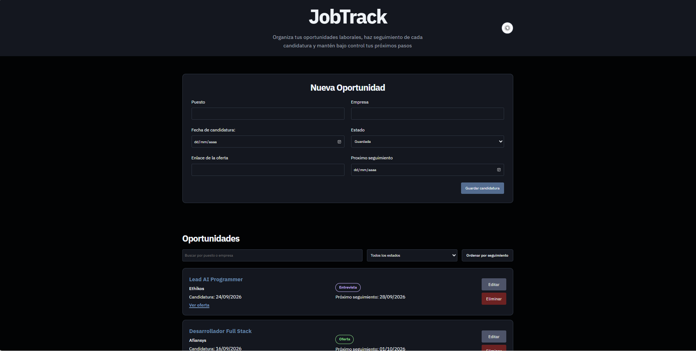

# JobTrack

JobTrack es una aplicación web para gestionar y organizar candidaturas laborales desde una única interfaz.

El proyecto está desarrollado con HTML, CSS y JavaScript vanilla y forma parte de mi portfolio de desarrollo web.

## Funcionalidades

- Crear nuevas oportunidades laborales.
- Editar candidaturas existentes.
- Cancelar una edición en curso.
- Eliminar oportunidades.
- Buscar por puesto o empresa.
- Filtrar candidaturas por estado.
- Ordenar por próximo seguimiento.
- Restablecer el orden original.
- Persistencia de datos mediante `localStorage`.
- Modo claro y oscuro con preferencia persistente.
- Validación del formulario.
- Mensajes de feedback al guardar o actualizar.
- Diseño responsive.
- Estados visuales para las distintas fases de una candidatura.

## Estados disponibles

- Guardada
- Enviada
- Entrevista
- Oferta
- Cerrada

## Tecnologías

- HTML5
- CSS3
- JavaScript
- LocalStorage
- Git
- GitHub

No se han utilizado frameworks ni librerías externas de JavaScript.

## Qué he trabajado en este proyecto

JobTrack me ha permitido practicar especialmente:

- creación de interfaces desde cero;
- HTML semántico;
- CSS Grid y Flexbox;
- responsive design;
- variables CSS y temas claro/oscuro;
- manipulación del DOM;
- eventos;
- formularios y validación;
- arrays de objetos;
- métodos como `map`, `filter`, `find` y `findIndex`;
- creación, edición y eliminación de datos;
- persistencia con `localStorage`;
- búsqueda, filtrado y ordenación;
- creación segura de elementos del DOM mediante `createElement` y `textContent`;
- gestión de errores con `try...catch`;
- accesibilidad básica y navegación mediante teclado;
- organización y mantenimiento de código frontend.

## Persistencia de datos

Las oportunidades se almacenan utilizando `localStorage`.

Esto significa que los datos permanecen disponibles al recargar la página, pero están asociados al navegador y dispositivo desde el que se utiliza la aplicación.

JobTrack no utiliza actualmente backend ni base de datos externa.

## Ejecutar el proyecto

No requiere instalación ni dependencias.

1. Clona o descarga el repositorio.
2. Abre `index.html` en el navegador.

También estará disponible mediante GitHub Pages.

## Captura

## Demo

https://dtasio.github.io/jobtrack/

## Posibles mejoras futuras

Algunas mejoras que podrían explorarse en versiones posteriores:

- backend y base de datos;
- autenticación;
- sincronización entre dispositivos;
- estadísticas de candidaturas;
- recordatorios de seguimiento;
- nuevas opciones de filtrado;
- evolución hacia una arquitectura frontend más avanzada.

Estas funcionalidades quedan fuera del alcance de la primera versión.

## Estado del proyecto

JobTrack V1 — completado y publicado.